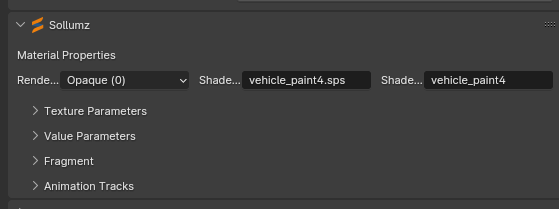
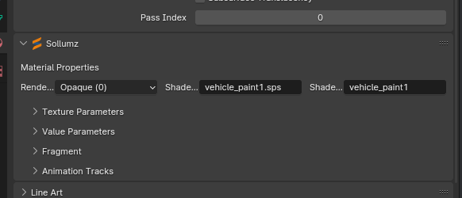
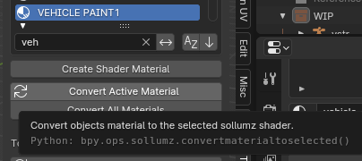

Petit article lié à mes activités au sein de l'équipe de SOZ.

# Voiture en paint4 pour le LSPD

La voiture doit passer en paint1 pour avoir la même configuration que les autres voitures du LSPD ( vehicle_paint1)

## How-To

Sur Blender, avec ZenUV, ce mettre en edit mode :

* sélectionner le vehicle_generic_smallspecmap [PRIMARY] en paint4 en UVMap 0
* Copier le UVMap 0
* Coller celui-ci dans UVMap 1

Pour ensuite convertir le materials en vehicle_paint1

### Pourquoi :

Cela permet de bouger le genericmudcar ( saleté ) dans le bon UVMap ( UVMap 1 pour paint1 mais UVMap 0 pour paint3 et paint4 ) pour ne pas avoir des soucis visuels dans les saletés.

# Passage d’un paint1 en paint4 pour Livery

La voiture doit passer en paint 3 ou 4 pour y recevoir des liveries ( sticker )

## How-To

Sur Blender, avec ZenUV, ce mettre en edit mode :

* Sélectionner le vehicle_generic_smallspecmap [PRIMARY] en paint4 en UVMap 1 
* Copier le UVMap 1
* Coller celui-ci dans UVMap 0

### Pourquoi :

Cela permet de bouger le genericmudcar ( saleté ) dans le bon UVMap ( UVMap 1 pour paint1 mais UVMap 0 pour paint3 et paint4 ) pour ne pas avoir des soucis visuels dans les saletés.

Et il faut éditer le UVMap 1 pour la livery
